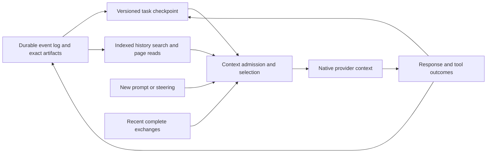

# AtomNano conversation context audit and bounded-continuation design

Date: 2026-09-10  
Project: `E:\Mac\AtomNano`  
Scope: Claude Agent SDK, Codex app-server and SDK fallback; per-prompt context, mid-turn input, synthesis into a new session, overflow recovery, summary reuse, prompt caching, archive pagination and relevant planner/reviewer paths.

**19 findings: 9 P1 and 10 P2.** P1 means a high-priority continuity, duplicate-action or blocked-conversation failure; P2 means a significant correctness, scaling or visibility problem. The document includes fixes and an implementation contract for handing this work to another AI.

This is an audit and implementation handoff. It adds this document and isolated evidence; it does not implement the fixes. No application source, dependencies, real conversations, credentials or provider accounts were changed or read as test data. No live model requests were made. The findings review the current code, including the newer budgeted-transfer implementation dated September 10; they do not assume the older agent audit's context defects are all still present.

The user's requested policy is the target: keep long conversations usable with a bounded current working context; carry a real summary into a synthesized session; continue the active task from the middle; retrieve relevant older details by pages; and avoid repeatedly summarizing or replaying the conversation from the first prompt. This supersedes the source comments and existing test expectations that prefer full verbatim transfer whenever it fits.

## Direct answer: what each prompt receives today

**A normal successful follow-up does not cause AtomNano to paste its entire saved transcript into the new prompt.** It sends the new input and resumes the provider's native session/thread. That native context still contains earlier exchanges, tool interactions and any native compaction state. The provider evaluates the new step using that active context; a small app-to-provider payload is not a small total model context.

| Situation | Claude path | Codex path | Practical effect |
|---|---|---|---|
| Brand-new empty session | SDK query without a resume ID; current input plus configured native system/project/tool context | thread/start, then turn/start with current input | No earlier conversation is transferred. Native project instructions/tools can still contribute context. |
| Next prompt after a successful turn | query with the same resume ID; no record block when the binding is caught up | thread/resume with excludeTurns, then turn/start; no history injection when caught up | Previous native context is reused. excludeTurns only suppresses the transcript returned to the app; it does not clear model history. |
| Many internal tool steps for one user prompt | SDK agent loop feeds tool results into subsequent evaluations | App-server agent loop keeps tool calls/results in its thread | Context can grow within one user-visible turn, even without another message from you. |
| Prompt while still running | Renderer attempts steering, then falls back to interrupt and a new resumed run | Live app-server turn/steer appends the new input; fallback paths interrupt and start another run | Latest steering must survive cancellation/overflow. Current cursor/recovery defects can duplicate or omit part of this state. |
| Queued prompt | Dispatched after the current turn | Same | It should become one new input using the completed turn's native context. |
| Switch A → B → A after successful turns | The returning Claude binding gets only events it missed while B ran | The returning Codex binding gets only events it missed | This works in the isolated successful-switch probe; it is not a blanket guarantee for failed/partial turns. |
| Lost native thread or first use of another provider | Budgeted transfer of missing canonical entries plus current input | Budgeted items injected into a fresh thread, then current input | Exact record first, shortened tool payloads second, cached summary plus recent tail only when the transfer estimate is exceeded. |
| Synthesize → new session | New app session contains the entire old transcript as one user entry; later subject to the transfer fallback | Same app-side seed | It is currently a full-record copy, not synthesis. This is the most direct source of oversized fresh-session input. |
| Scroll to or jump into older history, then send | The new prompt is appended at the current conversation end | Same | The visible page does not select model context or fork the native thread. Resend copies earlier text into a new prompt; it does not rewind. |
| Stop/failure followed by another prompt | Resume candidate remains, but acknowledgement cursor may lag | Same; an accepted injection may be repeated | Known source of duplicate history and prompt bloat. |

Source flow: [src/main/claude.js:390](E:/Mac/AtomNano/src/main/claude.js:390), [src/main/claude.js:505](E:/Mac/AtomNano/src/main/claude.js:505), [src/main/claude.js:560](E:/Mac/AtomNano/src/main/claude.js:560), [src/main/claude.js:1029](E:/Mac/AtomNano/src/main/claude.js:1029), [src/main/codex-appserver.js:331](E:/Mac/AtomNano/src/main/codex-appserver.js:331), [src/main/codex-appserver.js:477](E:/Mac/AtomNano/src/main/codex-appserver.js:477), [src/renderer/app.js:5317](E:/Mac/AtomNano/src/renderer/app.js:5317), [src/main/store.js:450](E:/Mac/AtomNano/src/main/store.js:450).

Claude's native loop already supports automatic compaction and emits compact-boundary events; retaining that functionality is appropriate. Its documented loop also explains why tool results grow context inside a single user request. [Claude Agent SDK loop](https://code.claude.com/docs/en/agent-sdk/agent-loop).

Codex's app-server supports native thread compaction, injection and steering. These are distinct operations; injecting older messages only appends context and does not replace an already full thread. [Codex app-server contract](https://learn.chatgpt.com/docs/app-server).

## Caching, history storage and active context are different

| Mechanism | What it retains/reuses | Does it prevent context-window overflow? |
|---|---|---|
| Canonical transcript/archive | The durable conversation record for UI/history/export | No. It is storage, not the model's active input. |
| Native Claude session / Codex thread | Provider-managed active conversation and compaction state | Supports continuity and native compaction; still bounded by the effective model limit. |
| Local summary cache | Generated summaries of covered source spans | Only when used in a bounded request plan. A cache hit can still be too large or stale. |
| Provider prompt cache | Reusable processing of eligible matching prompt prefixes | No. Cache hits reduce processing/cost for eligible input; the context still has to fit. |
| UI pagination/virtual rendering | A small slice of messages rendered on screen | No effect on the provider's active context. |
| Proposed history search/read tools | Selected old facts/results loaded on demand into a bounded working set | Yes, as part of bounded context planning and compaction; full historical recall remains retrieval-dependent. |

Claude explicitly counts uncached input, cache reads and cache creation toward the context window. Its cache documentation distinguishes these usage fields and explains prefix reuse. [Context windows](https://platform.claude.com/docs/en/build-with-claude/context-windows), [prompt caching](https://platform.claude.com/docs/en/build-with-claude/prompt-caching).

OpenAI cache reuse depends on a matching eligible prefix. Compaction can change that prefix and reduce the next cache hit, while the smaller input can still cost less overall. Do not keep irrelevant history merely to preserve a high cache percentage. [OpenAI prompt caching](https://developers.openai.com/api/docs/guides/prompt-caching).

**The achievable behavior is an arbitrarily long stored conversation with bounded per-step active context.** It is not an unlimited prompt, guaranteed perfect recall of every old detail, or a promise that providers can never return a size error. One oversized new user input and unexpectedly large tool output still need explicit handling. Cache expiry, model changes and account changes must affect performance/availability decisions, never whether the app can reconstruct the task.

## Evidence and limits

The installed packages reviewed are `@anthropic-ai/claude-agent-sdk 0.3.263` and `@openai/codex-sdk 0.153.4`. Read all of history.js and the relevant SessionManager, store, native adapter, main/preload and renderer paths; inspected installed SDK declarations and official provider documentation. Source fingerprints are in the manifest.

**40 isolated checks passed: 31 current-behavior reproductions, 8 positive controls and 1 source/contract check.** A passing reproduction means the reported defect was observed, not fixed. C25 verifies the app's arithmetic against documented OpenAI-shaped usage; it is not a capture of live Codex billing or a proof of the app-server's multi-step `last` semantics.

- [audit-evidence/context-2026-09-10/context-characterization.cjs](E:/Mac/AtomNano/audit-evidence/context-2026-09-10/context-characterization.cjs) runs original history, SessionManager and selected store/IPC functions with in-memory sessions, an injected SDK loader and recording/fault-injection providers. The synthesizer IPC handler is extracted unchanged from main.js; unrelated application startup is not run.
- [audit-evidence/context-2026-09-10/context-results.json](E:/Mac/AtomNano/audit-evidence/context-2026-09-10/context-results.json) contains each result and concrete measurements.
- [audit-evidence/context-2026-09-10/review-manifest.json](E:/Mac/AtomNano/audit-evidence/context-2026-09-10/review-manifest.json) records source fingerprints, finding/check mappings and official references.

No real accounts, network failures, model tokens, cache-hit ratios, model summary quality or full Electron UI flow were tested. Character counts are measured; actual tokenizer counts and end-to-end model behavior require the acceptance work below. Mocked provider outputs intentionally expose missing validation/recovery boundaries. The archive probe uses the original parser over a synthetic in-memory file.

Positive controls rule out several tempting but incorrect conclusions: normal successful Claude/Codex turns send only new input; successful A → B → A switches preserve the correct missing span; an unchanged same-start summary is reused; an advancing same-start summary folds only newer raw entries into cached state; and Claude's getContextUsage **control-response** camelCase fields do match the renderer. The separate SDK context event has another shape and should not be confused with that control response.

## Prioritized findings

| ID | Priority | Issue |
|---|---|---|
| CTX-001 | P1 | Synthesize creates a full-transcript prompt instead of a bounded continuation |
| CTX-002 | P1 | One large message bypasses summarization chunk limits |
| CTX-003 | P1 | The assembled summary has no enforced size contract |
| CTX-004 | P1 | Budgeting ignores the complete request and occupied native context |
| CTX-005 | P1 | Failed context preparation can strand Claude in a running state |
| CTX-006 | P1 | The current prompt boundary moves when planner/reviewer cards are appended |
| CTX-007 | P1 | Stop, retry and partial failure can replay context already accepted by the provider |
| CTX-008 | P1 | Overflow recovery omits work already completed in the failing turn |
| CTX-009 | P1 | Message deletion invalidates positional cursors and cached summaries |
| CTX-010 | P2 | Summary reuse is limited to matching starts and can discard the only reusable checkpoint |
| CTX-011 | P2 | A cache hit or a one-entry page can still scan the complete historical record |
| CTX-012 | P2 | A large recent entry can eliminate the entire exact recent tail |
| CTX-013 | P2 | Head-only tool shortening loses important outcomes without an exact retrieval path |
| CTX-014 | P2 | Synthesis loses selected session settings as it creates the continuation |
| CTX-015 | P2 | Claude recovery does not handle a second overflow after a lost-session retry |
| CTX-016 | P2 | Context telemetry is incomplete and is not used to prevent overflow |
| CTX-017 | P2 | Codex usage normalization adds cached tokens to input a second time |
| CTX-018 | P2 | Repeated procedures and auxiliary workflows keep adding avoidable context |
| CTX-019 | P2 | Separate summary calls are missing from the session's usage record |

### CTX-001 — P1: Synthesize creates a full-transcript prompt instead of a bounded continuation

**Source:** [src/main/main.js:741](E:/Mac/AtomNano/src/main/main.js:741), [src/renderer/app.js:5526](E:/Mac/AtomNano/src/renderer/app.js:5526).  
**Evidence:** C05; isolated characterization / source-contract evidence as qualified above.

The handler exports the archive and live messages, renders every history entry, and stores the combined record as a single user message in a fresh session. It makes no summary request. A synthetic 1,200,000-character conversation produced a 1,200,199-character seed and zero summary calls. Synthesizing again nests this seed and later messages; it does not establish a new checkpoint or incremental history lineage.

**Fix:** Replace the record-copy handler with a continuation job: snapshot the source event boundary, create or reuse a bounded task checkpoint, retain recent complete exchanges and immutable history references, then atomically create the destination with source lineage. The destination must carry the resulting context bundle, never a user message containing the full source transcript. Preserve the full original history in storage.

**Acceptance:** Synthesize a multi-megabyte session, continue it, then synthesize again. Each destination seed stays within its target input budget, the original transcript remains readable, and the second synthesis processes only newly uncovered events.

### CTX-002 — P1: One large message bypasses summarization chunk limits

**Source:** [src/main/claude.js:731](E:/Mac/AtomNano/src/main/claude.js:731), [src/main/history.js:170](E:/Mac/AtomNano/src/main/history.js:170).  
**Evidence:** C07; isolated characterization / source-contract evidence as qualified above.

summarizeRecord accepts the first entry in a chunk regardless of size. User and assistant text is not shortened by entryTextShort. The giant synthesized message therefore becomes one summarizer request: the probe sent 1,200,251 characters despite a 399,980-character transfer allowance. A large pasted prompt, assistant response or imported carriedRecord has the same shape. The supposed recovery can reproduce the original overflow.

**Fix:** Chunk within oversized entries as well as between entries. Use token-aware segments with stable message ID, byte/character offsets, ordered continuation markers and content hashes. Reduce these segments into a validated checkpoint without ever feeding the whole record to one summarization call. Preserve exact originals for lookup and handle Unicode boundaries correctly.

**Acceptance:** Use a single entry larger than the model window, a large code fence and multilingual text. Every summarizer call, including its instructions and previous summary, fits its own budget; all segments have continuous coverage and no source segment is silently lost.

### CTX-003 — P1: The assembled summary has no enforced size contract

**Source:** [src/main/claude.js:709](E:/Mac/AtomNano/src/main/claude.js:709), [src/main/claude.js:740](E:/Mac/AtomNano/src/main/claude.js:740), [src/main/history.js:191](E:/Mac/AtomNano/src/main/history.js:191).  
**Evidence:** C08; isolated characterization / source-contract evidence as qualified above.

The summary worker is asked for about 1,500 words, but returned text is accepted at any length. transferText and transferItems then concatenate it with the recent tail without measuring the final request. A deliberately oversized synthetic summary produced 106,558 characters under a 40,000-character allowance. Existing cached summaries are also reused without checking whether they fit a smaller destination model or reduced recovery budget.

**Fix:** Define and validate a token budget for each summary result and for the final provider-specific input. If a summary is too large, compact it using bounded input or select smaller checkpoint components; do not blindly truncate critical state. Reserve space for framing, the current prompt, selected context and output before admitting the final bundle.

**Acceptance:** Inject an oversized summarizer response and an oversized cached checkpoint, then switch to a smaller model. The final request is rebalanced or returns an actionable local preparation error before generation, never submitted oversized.

### CTX-004 — P1: Budgeting ignores the complete request and occupied native context

**Source:** [src/main/claude.js:690](E:/Mac/AtomNano/src/main/claude.js:690), [src/main/claude.js:505](E:/Mac/AtomNano/src/main/claude.js:505), [src/main/claude.js:1034](E:/Mac/AtomNano/src/main/claude.js:1034), [src/main/codex.js:38](E:/Mac/AtomNano/src/main/codex.js:38), [src/main/claude.js:324](E:/Mac/AtomNano/src/main/claude.js:324).  
**Evidence:** C09, C10, C11; isolated characterization / source-contract evidence as qualified above.

The current calculation gives transferred history half of a catalog window at four characters per token and keeps a positive floor of 20,000 characters. It does not subtract context already in a resumed thread. A 3,000,000-character current prompt still receives a history allowance; a 1,200,000-character prompt with no earlier history was submitted unchanged in the mocked Claude run. Images, native tools/project instructions and SDK-fallback file inlining are not included in promptChars. The four-character heuristic is not a reliable upper bound for arbitrary code, multilingual text or structured inputs.

**Fix:** Build one admission controller around the fully composed request and the runtime's actual active context. Count or conservatively estimate each input category, mark unknown quantities, and reserve output/reasoning and tool-result headroom. Use model/transport capabilities rather than one universal constant. If the user's new prompt alone cannot fit, preserve it and offer/use a clearly identified document-ingestion workflow; do not silently clip the user's instructions. Use native file references where supported and bounded materialization for fallback transports.

**Acceptance:** Test near-full resumes, smaller-model switches, large text, many images, large fallback attachments and long tool schemas. Every send either fits the measured effective limit or stops before submission with the prompt preserved. An empty native thread is distinguished from one that already holds history.

### CTX-005 — P1: Failed context preparation can strand Claude in a running state

**Source:** [src/main/claude.js:491](E:/Mac/AtomNano/src/main/claude.js:491), [src/main/claude.js:511](E:/Mac/AtomNano/src/main/claude.js:511), [src/main/claude.js:578](E:/Mac/AtomNano/src/main/claude.js:578), [src/main/claude.js:1890](E:/Mac/AtomNano/src/main/claude.js:1890).  
**Evidence:** C33, C36; isolated characterization / source-contract evidence as qualified above.

runAnthropic registers its runner before transferBlock, but its try/finally starts later. A summarizer rejection during transfer escapes cleanup, leaving both the runner and session marked running; the next send is rejected as already running. Separately, runHeadlessAnthropic only subscribes to future abort events, so an already-aborted parent signal still starts a new summary query. These failures are particularly likely during recovery from an oversized prompt.

**Fix:** Own preparation and generation in the same operation lifecycle and outer try/finally. Check cancellation before every chunk/model call, propagate an already-aborted signal immediately, and remove listeners when done. Persist successful checkpoint progress independently, restore the composer/pending request on failure, and end the preparation state without losing the source session.

**Acceptance:** Fail or cancel before the first summary, between chunks and after summary completion. No provider call starts after cancellation, no running slot remains, and Retry continues from the last valid checkpoint.

### CTX-006 — P1: The current prompt boundary moves when planner/reviewer cards are appended

**Source:** [src/main/claude.js:420](E:/Mac/AtomNano/src/main/claude.js:420), [src/main/claude.js:432](E:/Mac/AtomNano/src/main/claude.js:432), [src/main/claude.js:457](E:/Mac/AtomNano/src/main/claude.js:457), [src/main/claude.js:506](E:/Mac/AtomNano/src/main/claude.js:506), [src/main/claude.js:852](E:/Mac/AtomNano/src/main/claude.js:852).  
**Evidence:** C12, C13; isolated characterization / source-contract evidence as qualified above.

The user message is appended before optional workflows, but runAnthropic and runOpenAI later set promptIndex to the last canonical entry. Reviewer, planner and status cards can now occupy that index. The transfer therefore includes the current user prompt as earlier history, and the provider receives it again as its actual new input. Both mocked provider runs reproduced two occurrences. Retry paths also identify the prompt from the tail rather than from a durable turn identity.

**Fix:** Capture the new user message ID and immutable event sequence when accepting it and pass that boundary through planning, reviewing, preparation, retries and dispatch. Keep workflow artifacts explicitly associated with the same turn and include each selected artifact exactly once. Never infer a prompt's identity from the current array length.

**Acceptance:** Enable before-review, planning and both together. Each provider receives the current prompt once; its prior-history range ends before that exact prompt regardless of intervening status or workflow events.

### CTX-007 — P1: Stop, retry and partial failure can replay context already accepted by the provider

**Source:** [src/main/claude.js:614](E:/Mac/AtomNano/src/main/claude.js:614), [src/main/claude.js:1036](E:/Mac/AtomNano/src/main/claude.js:1036), [src/main/claude.js:1146](E:/Mac/AtomNano/src/main/claude.js:1146), [src/main/history.js:123](E:/Mac/AtomNano/src/main/history.js:123).  
**Evidence:** C14, C15, C16; isolated characterization / source-contract evidence as qualified above.

syncedIndex is advanced on normal completion, rather than on acknowledged history injection/input acceptance. After a stopped or failed turn, the native thread may already contain the user input, completed tool work and partial output while the app cursor remains behind. The next prompt can re-transfer these entries. The probes duplicated a retry's user text in Claude, reinjected stopped-turn content into a resumed Codex thread, and injected the same source history twice after a Codex network failure.

**Fix:** Separate prepared, injected, accepted-input and completed-output progress. Record acknowledgements against stable event IDs and a native-thread revision. Make injection idempotent/reconcilable; after an unknown outcome inspect provider state or start a controlled continuation instead of assuming nothing arrived. Keep normal successful delta-only continuation.

**Acceptance:** Inject connection loss immediately before and after history injection, input acceptance, first tool completion and turn completion. Retrying never submits the original accepted prompt or injected span a second time without an explicit new user request.

### CTX-008 — P1: Overflow recovery omits work already completed in the failing turn

**Source:** [src/main/claude.js:603](E:/Mac/AtomNano/src/main/claude.js:603), [src/main/claude.js:1032](E:/Mac/AtomNano/src/main/claude.js:1032), [src/main/claude.js:1085](E:/Mac/AtomNano/src/main/claude.js:1085).  
**Evidence:** C34, C39; isolated characterization / source-contract evidence as qualified above.

A context error can occur after several internal model/tool steps. Recovery creates a fresh native thread but transfers only through promptIndex - 1, the boundary before the current user prompt. Outputs and actions from the failed attempt remain in the visible canonical chat yet are missing from the replacement context. The original prompt is submitted again. Both provider probes showed a recorded current-turn action absent from the replacement input. Real side effects could consequently be repeated.

**Fix:** Distinguish rejection before any work from overflow during an agent loop. For the latter, checkpoint the current attempt's acknowledged actions, changed artifacts, results, unresolved operations and latest steering before rotating. Resume the remaining objective using that checkpoint; never replay a mutating instruction as though no work occurred. Represent unknown tool outcomes explicitly.

**Acceptance:** Trigger overflow after a file write and after a synthetic external mutation. The replacement context includes their outcomes and the model is asked to continue remaining work. An acceptance fixture asserts that each mutation occurs once.

### CTX-009 — P1: Message deletion invalidates positional cursors and cached summaries

**Source:** [src/main/store.js:584](E:/Mac/AtomNano/src/main/store.js:584), [src/main/history.js:31](E:/Mac/AtomNano/src/main/history.js:31), [src/main/history.js:214](E:/Mac/AtomNano/src/main/history.js:214), [src/renderer/app.js:6050](E:/Mac/AtomNano/src/renderer/app.js:6050).  
**Evidence:** C18, C23, C24; isolated characterization / source-contract evidence as qualified above.

deleteMessage splices the live array without adjusting native bindings or invalidating summary ranges. Later global indexes shift. A probe left syncedIndex pointing past an actually unseen newer entry, so pendingSync reported that no transfer was needed. Summary cache keys contain only numeric span boundaries; modified or deleted source content can still reuse the old summary. Removing a visible message also does not remove it from an existing native thread.

**Fix:** Use immutable event IDs/monotonic sequence numbers and tombstones or explicit branch revisions. Key summary validity by source revision/content coverage. Define UI deletion semantics honestly: hiding a message, removing it from future model context and branching from a prior point are separate operations. Rebuild/fork native context when a model-visible edit changes its history.

**Acceptance:** Delete/edit before a sync cursor and inside a cached span, restart, then switch providers. No unseen event is skipped, no stale summary is used, and any retained native knowledge is reflected in the UI's operation semantics.

### CTX-010 — P2: Summary reuse is limited to matching starts and can discard the only reusable checkpoint

**Source:** [src/main/history.js:214](E:/Mac/AtomNano/src/main/history.js:214), [src/main/history.js:220](E:/Mac/AtomNano/src/main/history.js:220), [src/main/claude.js:729](E:/Mac/AtomNano/src/main/claude.js:729), [src/main/store.js:338](E:/Mac/AtomNano/src/main/store.js:338).  
**Evidence:** C20, C35; isolated characterization / source-contract evidence as qualified above.

Caching works for an unchanged span and for advancing spans with the same from value. It cannot reuse an overlapping range with a different start, which is common when provider cursors differ. The global FIFO cap of 60 entries can also evict the only checkpoint for an older root span after unrelated summaries are added. A later recovery can therefore summarize old material again. Cached summaries are not transferred by the current synthesize handler.

**Fix:** Store versioned checkpoints over immutable segments with explicit coverage, plus a durable current-task state. Retain the latest usable checkpoint for each active branch independently from disposable intermediate summaries. Compose overlap from segment summaries and newly uncovered events. Persist lineage when synthesizing and do not treat the number 60 as a correctness boundary.

**Acceptance:** Alternate provider cursors, run auxiliary reviewers, exceed 60 cached entries and restart. An unchanged covered span requires no new summarization call; a growing branch processes only events after its coverage watermark.

### CTX-011 — P2: A cache hit or a one-entry page can still scan the complete historical record

**Source:** [src/main/history.js:170](E:/Mac/AtomNano/src/main/history.js:170), [src/main/store.js:369](E:/Mac/AtomNano/src/main/store.js:369), [src/main/store.js:486](E:/Mac/AtomNano/src/main/store.js:486), [src/main/main.js:742](E:/Mac/AtomNano/src/main/main.js:742).  
**Evidence:** C19, C40; isolated characterization / source-contract evidence as qualified above.

planTransfer reads the entire requested span, serializes an exact version and often a shortened version before consulting summaries. A successful summary cache hit thus saves model calls but not the initial full-history read/serialization. readArchive reads and parses the complete JSONL file before serving a page; requesting one entry in a 5,000-entry fixture parsed all 5,000 entries and read 1,293,890 characters. Synthesis additionally exports the whole record synchronously.

**Fix:** Index the event log by stable sequence and byte offsets, or use an indexed local database. Fetch only the coverage delta and requested pages; keep token/byte metadata per event/segment so the planner can choose context without rendering every old message. Move large storage/serialization work off the Electron main thread. Keep originals accessible without loading all of them.

**Acceptance:** Compare 1k, 10k and 100k stored-message sessions with the same recent working set. Steady-state context planning reads only the delta/checkpoint and targeted pages; old-page reads have bounded bytes/parsed records. Record p95 main-thread delay and memory, not just model-token savings.

### CTX-012 — P2: A large recent entry can eliminate the entire exact recent tail

**Source:** [src/main/history.js:181](E:/Mac/AtomNano/src/main/history.js:181), [src/main/claude.js:159](E:/Mac/AtomNano/src/main/claude.js:159).  
**Evidence:** C21; isolated characterization / source-contract evidence as qualified above.

The recent-tail selector stops at the first entry that exceeds its allotted share. If the newest entry is large, tailStart stays at the end and every entry is summarized. The probe produced zero exact recent entries. The fixed 1,500-word summary request describes historical goals but has no separate current-task record, latest-correction record or guarantee that an objective introduced halfway through survives compression.

**Fix:** Select recent complete exchanges using task and event boundaries, with explicit space for the current prompt and latest accepted steering. Move oversized payloads to retrievable artifacts while retaining their essential outcome and immutable reference. Maintain a small structured active-task checkpoint that marks superseded objectives and pending work rather than a chronological list of every old goal.

**Acceptance:** Introduce a new objective midway through a long conversation, correct it near the end, and append one huge tool/reply payload. After compaction or synthesis the active objective and latest correction remain exact, while an unrelated first task is not restarted.

### CTX-013 — P2: Head-only tool shortening loses important outcomes without an exact retrieval path

**Source:** [src/main/history.js:142](E:/Mac/AtomNano/src/main/history.js:142), [src/main/history.js:146](E:/Mac/AtomNano/src/main/history.js:146), [src/main/history.js:152](E:/Mac/AtomNano/src/main/history.js:152), [src/main/codex-appserver.js:470](E:/Mac/AtomNano/src/main/codex-appserver.js:470).  
**Evidence:** C22, C30; isolated characterization / source-contract evidence as qualified above.

Tool inputs retain 600 characters and results 1,500, then tell the model to re-read the source. A log probe lost its critical failure at the end. A command result is not necessarily reconstructible from a current file: the file may have changed, the command may mutate data, or the result may have come from a remote tool. The shortened entry includes neither its canonical message ID nor a callable immutable-result reference. Existing chat search/page IPC is a renderer feature, not a provider history tool.

**Fix:** Store exact tool inputs/results as immutable artifacts and expose bounded read/search APIs to both agents. Carry a concise typed outcome, status/exit code, useful head/tail/error excerpts and artifact identity. Never ask the model to rerun a command merely to recover old output. Search results and reads must be token-bounded and scoped to this conversation/authorized lineage.

**Acceptance:** Place the only error at the end of a long log and later change/delete its source file. The agent can retrieve the original result by ID without rerunning the tool, and the initial compact view truthfully states the failure.

### CTX-014 — P2: Synthesis loses selected session settings as it creates the continuation

**Source:** [src/main/main.js:748](E:/Mac/AtomNano/src/main/main.js:748), [src/main/store.js:519](E:/Mac/AtomNano/src/main/store.js:519), [src/main/store.js:335](E:/Mac/AtomNano/src/main/store.js:335).  
**Evidence:** C06; isolated characterization / source-contract evidence as qualified above.

The synthesis call forwards cwd, name, model and thinking but omits permissionMode, oneM and selectedSkills. createSession does not accept oneM, and the handler only copies editedFiles and the full record. In the probe, a Plan session with the 1M selection and a chosen skill became a default-mode session with those selections absent. This can reduce the destination's available context at the same time a giant seed is added.

**Fix:** Define an explicit continuation-settings contract, including destination provider/model capabilities, effective context selection, permissions and user-selected procedures. Preserve supported choices and show any required change. Keep new native thread IDs as new identities, while carrying source checkpoint and archive lineage separately.

**Acceptance:** Synthesize sessions using Plan mode, 1M context and selected skills for each provider. Applicable selections survive; unsupported combinations are resolved visibly before generation, and no native thread ID is accidentally reused.

### CTX-015 — P2: Claude recovery does not handle a second overflow after a lost-session retry

**Source:** [src/main/claude.js:581](E:/Mac/AtomNano/src/main/claude.js:581), [src/main/claude.js:587](E:/Mac/AtomNano/src/main/claude.js:587), [src/main/claude.js:595](E:/Mac/AtomNano/src/main/claude.js:595).  
**Evidence:** C32; isolated characterization / source-contract evidence as qualified above.

The lost-session and too-long branches share one inner catch. If the fresh run inside the lost-session branch itself fails because its transferred record is too large, that error jumps to the outer generic error path instead of the bounded-summary recovery branch. The synthetic sequence 'session gone, then prompt too long' ended after two attempts in error with no forced-summary recovery.

**Fix:** Use an explicit finite recovery state machine with classified outcomes and a strict attempt budget. Each new request must pass admission first; a failed-resume recovery must still be eligible for a smaller validated context. Keep the original prompt, native binding and prepared checkpoint until a replacement is safely accepted.

**Acceptance:** Exercise lost thread then overflow, overflow then summary failure, network failure then overflow and cancellation at each boundary. Recovery is bounded, progresses to a smaller validated request when appropriate, and never becomes a blind retry loop.

### CTX-016 — P2: Context telemetry is incomplete and is not used to prevent overflow

**Source:** [src/main/claude.js:1749](E:/Mac/AtomNano/src/main/claude.js:1749), [src/main/claude.js:1352](E:/Mac/AtomNano/src/main/claude.js:1352), [src/main/codex-appserver.js:416](E:/Mac/AtomNano/src/main/codex-appserver.js:416), [src/main/codex-appserver.js:421](E:/Mac/AtomNano/src/main/codex-appserver.js:421), [src/renderer/app.js:4863](E:/Mac/AtomNano/src/renderer/app.js:4863), [node_modules/@anthropic-ai/claude-agent-sdk/sdk.d.ts:2769](E:/Mac/AtomNano/node_modules/@anthropic-ai/claude-agent-sdk/sdk.d.ts:2769).  
**Evidence:** C26, C28, C29, C30; isolated characterization / source-contract evidence as qualified above.

Codex's runner exposes interrupt/steer but not getContextUsage, so the shared endpoint returns null even during a Codex run; incoming usage/window data is kept mainly for the result footer. Claude compact_boundary events are discarded. Native Codex compaction is noticed after completion, but no manual thread/compact/start operation is wired. Claude's meter uses the correct camelCase control-response shape, but polls getContextUsage without detail every three seconds; the installed SDK defaults this to full category token-count calls. None of this feeds pre-send admission.

**Fix:** Normalize provider telemetry into separate active-context, hard-limit, compaction-policy, usage and cache fields. Persist the last known per-binding context state, mark estimates/unknowns, use cheap summary polling or pushed events, and request a full breakdown only when useful. Record compacting/success/failure events and connect capability-checked native compaction to the admission lifecycle.

**Acceptance:** Both providers display measured/estimated active context and compaction state during and between turns. Codex never appears as zero merely because data is unavailable. Claude periodic polling requests summary detail. Native compaction completes and its new context epoch is recorded before dependent generation.

### CTX-017 — P2: Codex usage normalization adds cached tokens to input a second time

**Source:** [src/main/codex-appserver.js:423](E:/Mac/AtomNano/src/main/codex-appserver.js:423), [src/main/claude.js:1138](E:/Mac/AtomNano/src/main/claude.js:1138), [src/renderer/app.js:6466](E:/Mac/AtomNano/src/renderer/app.js:6466), [node_modules/@openai/codex-sdk/dist/index.d.ts:120](E:/Mac/AtomNano/node_modules/@openai/codex-sdk/dist/index.d.ts:120).  
**Evidence:** C25; isolated characterization / source-contract evidence as qualified above.

The app copies Codex input/cache fields directly, then adds input_tokens + cached_input_tokens + cache_write_input_tokens to the session total, reusing Anthropic-style accounting. A replay with 1,000 total input, 800 cache-read and 100 cache-write records 1,900 input tokens. OpenAI's documented usage treats cache categories as subsets of total input. The code also assumes tokenUsage.last is cumulative for the whole user turn; that interpretation is not established by this audit and must be checked for multi-step turns against the pinned app-server. This is a contract/arithmetic finding, not a measurement of your billed usage.

**Fix:** Normalize each transport according to its actual usage contract. Retain raw usage frames and distinguish request totals, user-turn deltas, thread totals and active-window estimates. Derive Codex turn totals from documented events or monotonic thread-total deltas scoped to an epoch; do not add cache subsets twice. Keep Anthropic's documented three-part input accounting separate.

**Acceptance:** Replay known usage frames and then verify one real multi-step turn on each pinned transport. Cached input never exceeds the corresponding total, session sums reconcile with provider totals, and compaction/new-thread resets do not create negative or duplicate deltas.

### CTX-018 — P2: Repeated procedures and auxiliary workflows keep adding avoidable context

**Source:** [src/main/claude.js:369](E:/Mac/AtomNano/src/main/claude.js:369), [src/main/claude.js:377](E:/Mac/AtomNano/src/main/claude.js:377), [src/main/claude.js:777](E:/Mac/AtomNano/src/main/claude.js:777), [src/main/claude.js:1849](E:/Mac/AtomNano/src/main/claude.js:1849).  
**Evidence:** C31; isolated characterization / source-contract evidence as qualified above.

Every prompt appends the full body of every checked skill, even when the same native thread already holds it. A synthetic procedure added 18,071 characters to the second prompt. Reviewers/planners are also given a from-start transfer each time; their current prompt/answer and framing are not consistently included in the shared review budget. Native prompt caching does not remove these appended copies from active context. Some workflow duplication is also caused by the prompt-boundary defect above.

**Fix:** Track user-selected procedure content hashes and binding/checkpoint revisions. Reuse a stable provider-supported instruction/skill representation and send only changed selections or needed expansions; ensure persistent requirements survive compaction. Give auxiliary workflows the bounded current task and relevant pages through the same complete-request admission contract. Do not remove an explicitly selected procedure or silently change its meaning.

**Acceptance:** Run 100 short turns with one unchanged selected procedure. There is one logical active copy per context epoch, not 100 appended bodies. A skill edit or selection change is applied once and remains effective after compaction; reviewer/planner prompts stay bounded.

### CTX-019 — P2: Separate summary calls are missing from the session's usage record

**Source:** [src/main/claude.js:752](E:/Mac/AtomNano/src/main/claude.js:752), [src/main/claude.js:757](E:/Mac/AtomNano/src/main/claude.js:757), [src/main/claude.js:1890](E:/Mac/AtomNano/src/main/claude.js:1890), [src/main/claude.js:1477](E:/Mac/AtomNano/src/main/claude.js:1477).  
**Evidence:** Source inspection; separate summary calls do not return usage to primary accounting.

The summary worker returns only text. The Codex branch discards res.usage, and runHeadlessAnthropic consumes text while ignoring result usage/cost. The source session's ordinary accounting runs through the primary-result handler, which these calls do not use. Repeated summarization can therefore add latency and provider usage without appearing in the session total. The helper also selects a separate low-effort summary run; this should be represented as a context-preparation job rather than confused with the user's chosen generation effort.

**Fix:** Return structured summary-job output: text/checkpoint, terminal status, provider/model/effective settings, usage, duration and source coverage. Charge each successful/failed model call to its owning preparation job exactly once and expose a compact preparation status. Keep provider prompt-cache savings separate from local checkpoint reuse.

**Acceptance:** A synthesis requiring multiple summary calls reconciles its preparation usage and duration with the provider responses. A checkpoint cache hit records zero new summary calls. Cancellation/failure records only actual calls and never fabricates a successful summary.

## Target design: bounded context with retrievable history

The model should begin each step with the current objective, relevant accepted constraints, the latest prompt/steering, recent unresolved exchanges and the evidence needed for the next action. The archive can continue growing. Context planning should not start by reading, concatenating or summarizing all of it again.

### 1. Keep an immutable history record and a small active-task record

Use stable event IDs, monotonically increasing sequence numbers and a branch/revision identity. Store the original user input, assistant output and tool artifacts once. Changes to what should be model-visible must create revisions/tombstones or a branch; array positions must not act as durable identities.

| State | Required content | Retention rule |
|---|---|---|
| Active objective | Current requested outcome, scope and completion condition | Update when the user changes the task; do not leave the first task permanently dominant. |
| Accepted constraints | Explicit user preferences, corrections, permissions and relevant project constraints, with source IDs | Preserve relevant decisions and mark replaced ones superseded; do not append copies indefinitely. |
| Work completed | Verified changes, artifacts and test outcomes needed to continue | Keep concise facts plus exact evidence pointers. |
| Work remaining | Pending steps, unresolved decisions and known blockers | Update from new accepted events. |
| Current attempt | Accepted prompt/steering IDs, acknowledged tool actions, partial outcomes and unknown operations | Preserve through stop/retry/overflow until reconciled. |
| Recent exchanges | A token-bounded selection of complete interaction groups | Keep current unresolved dialogue exact where feasible; move large payloads to artifacts. |
| Historical segments | Immutable event ranges with token/byte metadata and optional segment summaries | Store indefinitely according to user retention preferences; retrieve selectively. |
| Native binding | Provider, effective account scope, thread ID, context epoch, acknowledged coverage and latest usage | A resume ID alone is not proof of what was accepted or what remains active after compaction. |

Do not automatically inject a broad project-memory digest, old audit instructions or all prior objectives into every prompt. Only selected, applicable state belongs in active context. The current prompt stays its own input; stored historical instructions retain their provenance and should not be promoted above later user corrections.

### 2. Advance checkpoints instead of reprocessing history from zero

A checkpoint should record source branch/revision, covered event IDs/range, summarizer schema/version, current task state, pending attempt state, content hashes and exact artifact references. Produce it from the previous valid checkpoint plus newly completed/uncovered events. Keep the latest usable checkpoint durable; evict intermediate caches only when reconstruction remains possible without losing coverage.

Persist immutable segment summaries separately from the aggregate task checkpoint. When a new task starts halfway through the chat, update the active task state and retrieve old segments only if they help that task. Do not repeatedly flatten every earlier summary into a larger running summary. If an early summary has inadequate detail, retrieve the cited source segment; do not silently invent missing facts.

For preexisting large chats that have no checkpoint, a one-time backfill may need to read all previously unsummarized material. Process it in bounded chunks and persist progress. There is no honest way to reconstruct unseen historical facts without reading them somewhere. The requirement is **no repeated from-start processing after coverage has been established**, and no oversized backfill request.

If the user opens/sends a prompt while a checkpoint job is running, capture the original coverage boundary and queue the new event as a delta. Cancel/retry/restart must not mix different snapshots or cause the same span to be billed twice merely because the app restarted.

### 3. Plan the entire provider request before submitting it

The admission invariant is:

**active native input + new input + any admitted history/artifacts + required output/continuation reserve ≤ the effective context allowance.**

For a fresh native context, build the full bundle within this allowance. For a resumed native context, the existing active state is already present: do not add a checkpoint/recent-tail copy simply because the app rebuilt a plan. Resume with new input only while the existing state is valid and has space. When it needs compaction, perform an acknowledged replacement/compaction step and advance the native context epoch before sending dependent input.

Count instructions, tools, images/documents, selected skills, workflow output, framing and the actual fallback representation. Reserve reasoning/output according to the provider's contract; do not count the same output reserve twice. Catalog values are hints until reconciled with runtime capabilities and any smaller compaction policy. Keep estimates and unknowns explicit.

Use a soft operating target below the hard limit so a tool result or steering message has room to arrive. The exact target should be driven by the selected model and measured workloads, not an arbitrary number of conversation turns. This is a limit on **active context admission**, not a cap on stored history, requested answer quality, task duration or the user's saved prompt.

If mandatory input alone is too large, preserve the complete input, identify the oversized portion, and use a clearly described artifact/chunk-ingestion path. A summary must not silently substitute for a user's exact critical requirements.

### 4. Add real provider-accessible history pagination

The current renderer search/page IPC is not an agent memory system. Add a small tool surface to both provider integrations using their supported tool mechanisms, with version/capability checks. The Codex adapter currently rejects dynamic tool calls and will need an actual registration/dispatch implementation; Claude can use an explicitly configured local tool/MCP service.

| Operation | Returns | Boundaries |
|---|---|---|
| History search | Relevant event/segment IDs, short matching excerpts, why they match, continuation cursor | Search current task/branch by default; token/result budget; include tool outputs and relevant artifact metadata, not only message.text. |
| Read event/page | Exact ordered entries or an exact excerpt with offsets, next cursor and completeness flag | Immutable IDs/revisions; explicit token budget; return only the requested page. |
| Read artifact | Exact historical tool/file excerpt with content hash and offsets | Read the saved version; do not rerun a command or substitute today's changed file. |
| Task checkpoint | Current objective, accepted decisions, completed/remaining work and coverage | Small, versioned and scoped to the active conversation. |

Tool output must be bounded too: merely adding a history tool that returns the entire chat would recreate the problem. Track what excerpts are already active and do not append duplicates on each lookup. Scope access to the current conversation and explicitly linked source lineage; summarize results without leaking unrelated sessions or credentials.

Paging is retrieval, not a promise that a model can inspect an unlimited number of old pages for free. Large historical comparisons may need a separate bounded aggregation job. Keep visible evidence links so omitted details can be inspected when they matter.

### 5. Use native provider compaction and portable checkpoints for their respective jobs

| Integration | Implementation direction |
|---|---|
| Claude Agent SDK | Preserve normal resume. Use supported context reporting with cheap summary detail for periodic polling, and record compacting/boundary/success/failure state. Integrate supported native compaction at safe boundaries. Keep a portable task checkpoint for lost sessions, synthesis, provider changes and exact evidence retrieval. Do not paste the full archive alongside an already compacted native session. |
| Codex app-server | Preserve thread/resume and delta-only turn/start/steer. Add capability-checked thread/compact/start with operation lifecycle notifications, persist context epochs and reconcile injected/accepted event IDs. Use portable checkpoints for controlled thread replacement and cross-provider continuation. |
| Codex SDK fallback | Treat its input/stream/compaction capabilities separately. Do not inline every attached file in full merely because the app-server is unavailable. Resume known compatible state or prepare a bounded fresh context; retain the same objective/evidence contract. |
| Direct API compaction | Only relevant if a direct Responses/Messages path is intentionally implemented. Do not pass REST-only cache or compaction fields into a native SDK call that does not support them. |

OpenAI's app-server compaction request returns immediately; completion arrives through lifecycle notifications, so await the outcome rather than treating the RPC acknowledgement as finished compaction. [App-server compaction](https://learn.chatgpt.com/docs/app-server).

OpenAI's separate API compact endpoint produces an opaque compacted context that must be carried according to that API's contract, and its input must already fit. It is not a cross-provider summary format or a repair for an unlimited oversized request. [OpenAI API compaction](https://developers.openai.com/api/docs/guides/compaction).

### 6. Make cache behavior measurable without depending on it for correctness

Keep stable native instructions/tools/procedure content stable where supported, and append only new user input or changed applicable state. Do not rewrite a cached prefix with timestamps, growing count banners or a regenerated whole-conversation digest each turn.

Use only cache controls exposed by the selected native transport. Direct API cache-breakpoint fields are not automatically SDK options. Preserve native session identity where valid, but do not retain obsolete context solely to chase cache hits. Cache expiry or a model/account switch may cause a cold request; continuation must still work from durable state.

Report these separately: active context tokens, new input tokens, cached input, cache writes, output/reasoning usage, compaction/summary calls and locally reused checkpoints. OpenAI cache categories are subsets of total input, whereas Anthropic reports three input components; adapter-specific normalization is required. [OpenAI caching usage examples](https://developers.openai.com/api/docs/guides/prompt-caching), [Claude caching usage](https://platform.claude.com/docs/en/build-with-claude/prompt-caching).

### 7. Show preparation and continuity truthfully in the UI

Replace the synthesized-context toast with states that correspond to real work: preparing checkpoint, loading recent context, ready, cancelled or failed. Show a small expandable context explanation with current objective, native resume/fresh state, checkpoint coverage, recent entries retained, retrieved pages and estimated/measured token use. Keep it separate from answer text and tool output.

A send while viewing an older message should clearly continue at the current end. If branch-from-here is desired, implement it as a separate operation with an explicit source boundary and a new native binding. Merely scrolling is not a reason to change what the model knows.

Preserve current output/scroll/focus during compaction and prevent a long synchronous archive scan from freezing the window. Summarization progress and errors must never leave the tab permanently running.

## Implementation order and completion checks

1. **Stop oversized input and broken synthesis:** CTX-001–005 and CTX-014–015. Establish stable prompt IDs and one operation lifecycle while replacing full-record seeds, bounding summary input/output and validating complete requests.
2. **Fix continuity correctness:** CTX-006–009. Add acknowledgement/attempt state, recover partial work without replay, and replace mutable positional identities. These contracts must land before broad automatic rotation.
3. **Build incremental state and retrieval:** CTX-010–013. Add durable checkpoints, indexed archive pages and provider-accessible exact history/artifact retrieval. Backfill old chats once, with resumable progress.
4. **Integrate native context control and observability:** CTX-016–019. Add provider-specific compaction, consistent usage/cache accounting, bounded procedure/workflow context and summary-job telemetry.
5. **Validate long-running behavior on both real providers and the packaged app.** Convert characterization cases into regression assertions for the corrected behavior; preserve their IDs and the previous reproduction evidence.

| Acceptance scenario | Required result |
|---|---|
| 1k → 10k → 100k stored messages with a fixed current task | Active input remains bounded; planning/storage reads scale with the new delta and selected pages, not the whole transcript. |
| Ordinary successful follow-ups | New prompt once, native resume maintained, no historical reinjection or repeated procedure bodies. |
| New objective in the middle, later correction, then compaction/synthesis | Continue that objective using the latest accepted correction; do not restart or prioritize an unrelated initial task. |
| Existing huge chat with no checkpoint | One resumable chunked backfill; every request fits; subsequent updates start after the coverage watermark. |
| Synthesize, continue, synthesize again | Bounded portable seed, no nested full transcript, preserved supported settings and exact source lineage. |
| Single huge prompt/assistant reply/tool output/image set | Bounded segmentation or preserved actionable admission failure; no silent loss of critical requirements. |
| Provider/account/model switch, including smaller context | Correct effective identity and capabilities; coherent task/evidence context; cold cache affects performance only. |
| Stop/retry at input, injection and tool boundaries | Each acknowledged input/span/action accounted for once; unknown outcomes explicitly reconciled. |
| Context failure after an action or a steering message | Replacement includes current-attempt work and latest steering; no duplicate external mutation. |
| Edit/delete/branch followed by restart and switch | Correct source revision, no shifted cursor or stale summary; native context semantics match the requested action. |
| Retrieve an old command result after its source changed | Exact historical excerpt by immutable ID; no command rerun. |
| Cache warm, expired and unavailable | Correct continuation and token accounting in all cases; actual cache hit/miss and preparation costs are visible. |
| Summary model failure or cancellation at every await | No orphan runner; source preserved; resume from valid checkpoint; no post-cancel generation. |
| Near-limit native compaction and very large result rendering | Lifecycle acknowledgement, stable UI and measured main-thread responsiveness; no hidden full-history scans. |

For model quality, create synthetic conversations with checkable facts and deliberately superseded instructions: an objective at turn 1, a new active objective around turn 100, an exact path/decision around turn 150 and a correction near turn 200. After compaction, ask about current work and then a specifically cited old fact. Score task continuation, latest-correction compliance, exact-fact retrieval and absence of re-execution. Storage size alone is not a quality test.

Do not claim “unlimited context” or “no prompt-too-long errors ever.” Completion requires bounded local request construction, tested provider-native behavior, durable recoverability and clear handling when mandatory input or provider state is still too large.

## Handoff instruction for the implementing AI

Implement this context backlog in the order above. Preserve unrelated user changes and keep the existing agent/Git/DB audits separate. Recheck the manifest fingerprints before editing because the project is actively changing.

Keep the complete conversation and exact artifacts in storage. Replace full-record synthesis and from-start active-context construction with versioned task checkpoints, a bounded recent working set and indexed retrieval. Preserve successful native resume/delta behavior. Maintain current user prompt/steering identity and acknowledged attempt state so interruption, retry and provider changes do not duplicate work or forget the latest instruction.

Use provider-supported APIs and inspect the installed SDK/CLI contracts. Measure complete requests and distinguish estimates from actual usage. Preserve user-selected models, generation effort and applicable settings; identify separate summary preparation calls in telemetry. Do not introduce unrelated behavior prefixes, answer caps or forced provider changes.

For each finding, record changed files, behavior, regression evidence and real-provider limits. The existing audit harness intentionally asserts current bugs; update each repaired case to assert the desired behavior. Do not run tests on saved user conversations/accounts without an explicitly isolated test setup. Keep credentials and raw prompt contents out of diagnostic logs; token counts, content hashes, IDs and coverage ranges normally suffice.

